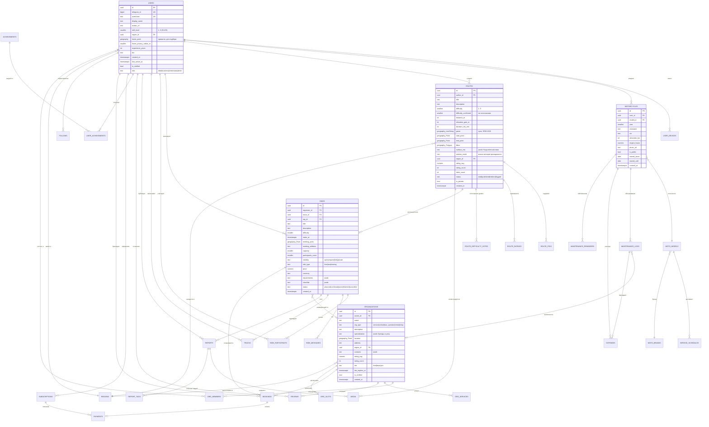

# 04. Модель данных: ER-диаграмма и схема БД

СУБД: **PostgreSQL 16 + PostGIS 3.4**. Выбор не обсуждается — геопространственные запросы («маршруты в радиусе 100 км», «выезды рядом») являются ядром продукта, и делать их на MongoDB или в приложении — архитектурная ошибка.

## 1. ER-диаграмма



## 2. Схема таблиц (DDL, PostgreSQL 16 + PostGIS)

### 2.1. Расширения и типы

```sql
CREATE EXTENSION IF NOT EXISTS "uuid-ossp";
CREATE EXTENSION IF NOT EXISTS postgis;
CREATE EXTENSION IF NOT EXISTS pg_trgm;       -- нечёткий поиск по названиям
CREATE EXTENSION IF NOT EXISTS btree_gist;

CREATE TYPE user_role       AS ENUM ('rider','business','moderator','admin');
CREATE TYPE route_status    AS ENUM ('draft','published','hidden','flagged','archived');
CREATE TYPE ride_visibility AS ENUM ('open','request','link','private');
CREATE TYPE ride_type       AS ENUM ('free','tour','training','competition');
CREATE TYPE ride_status     AS ENUM ('planned','confirmed','active','finished','cancelled');
CREATE TYPE participant_status AS ENUM ('requested','approved','declined','joined','no_show','completed','left');
CREATE TYPE org_type        AS ENUM ('service','school','tour_operator','rental','shop','club');
CREATE TYPE org_tier        AS ENUM ('free','basic','pro');
CREATE TYPE booking_status  AS ENUM ('pending','paid','confirmed','cancelled','refunded','completed');
CREATE TYPE payment_status  AS ENUM ('created','succeeded','failed','refunded','partially_refunded');
CREATE TYPE poi_type        AS ENUM ('ford','obstacle','fuel','viewpoint','camp','danger','parking','water','repair');
CREATE TYPE media_type      AS ENUM ('photo','video');
CREATE TYPE sub_plan        AS ENUM ('monthly','seasonal','annual');
```

### 2.2. Пользователи и география

```sql
CREATE TABLE regions (
    id           uuid PRIMARY KEY DEFAULT uuid_generate_v4(),
    name         text NOT NULL,
    country_code char(2) NOT NULL DEFAULT 'RU',
    timezone     text NOT NULL DEFAULT 'Europe/Moscow',
    center       geography(Point,4326) NOT NULL,
    boundary     geography(Polygon,4326),
    slug         text UNIQUE NOT NULL
);
CREATE INDEX idx_regions_center ON regions USING GIST (center);

CREATE TABLE users (
    id                 uuid PRIMARY KEY DEFAULT uuid_generate_v4(),
    telegram_id        bigint UNIQUE,
    phone              text UNIQUE,
    email              text UNIQUE,
    username           text UNIQUE NOT NULL,
    display_name       text NOT NULL,
    avatar_url         text,
    skill_level        smallint NOT NULL DEFAULT 1
                       CHECK (skill_level BETWEEN 1 AND 5),
    region_id          uuid REFERENCES regions(id),
    home_point         geography(Point,4326),           -- НИКОГДА не отдаётся в API
    home_privacy_radius_m smallint NOT NULL DEFAULT 1000,
    experience_years   smallint DEFAULT 0,
    bio                text,
    role               user_role NOT NULL DEFAULT 'rider',
    is_verified        boolean NOT NULL DEFAULT false,
    is_banned          boolean NOT NULL DEFAULT false,
    settings           jsonb NOT NULL DEFAULT '{}'::jsonb,
    created_at         timestamptz NOT NULL DEFAULT now(),
    last_active_at     timestamptz NOT NULL DEFAULT now()
);
CREATE INDEX idx_users_home       ON users USING GIST (home_point);
CREATE INDEX idx_users_region     ON users (region_id);
CREATE INDEX idx_users_active     ON users (last_active_at DESC);
CREATE INDEX idx_users_name_trgm  ON users USING GIN (display_name gin_trgm_ops);

CREATE TABLE user_devices (
    id           uuid PRIMARY KEY DEFAULT uuid_generate_v4(),
    user_id      uuid NOT NULL REFERENCES users(id) ON DELETE CASCADE,
    platform     text NOT NULL,            -- ios | android | web | telegram
    push_token   text,
    app_version  text,
    last_seen_at timestamptz NOT NULL DEFAULT now(),
    UNIQUE (user_id, push_token)
);

CREATE TABLE follows (
    follower_id  uuid NOT NULL REFERENCES users(id) ON DELETE CASCADE,
    followee_id  uuid NOT NULL REFERENCES users(id) ON DELETE CASCADE,
    created_at   timestamptz NOT NULL DEFAULT now(),
    PRIMARY KEY (follower_id, followee_id),
    CHECK (follower_id <> followee_id)
);
```

### 2.3. Техника и гараж

```sql
CREATE TABLE moto_brands (
    id   uuid PRIMARY KEY DEFAULT uuid_generate_v4(),
    name text UNIQUE NOT NULL,
    logo_url text
);

CREATE TABLE moto_models (
    id            uuid PRIMARY KEY DEFAULT uuid_generate_v4(),
    brand_id      uuid NOT NULL REFERENCES moto_brands(id),
    name          text NOT NULL,
    category      text NOT NULL,          -- enduro | cross | dual_sport | trial | atv | snowmobile
    engine_cc     smallint,
    year_from     smallint,
    year_to       smallint,
    weight_kg     smallint,
    uses_hours    boolean NOT NULL DEFAULT false,  -- считаем моточасы, а не км
    UNIQUE (brand_id, name, year_from)
);
CREATE INDEX idx_models_name_trgm ON moto_models USING GIN (name gin_trgm_ops);

CREATE TABLE motorcycles (
    id            uuid PRIMARY KEY DEFAULT uuid_generate_v4(),
    user_id       uuid NOT NULL REFERENCES users(id) ON DELETE CASCADE,
    model_id      uuid REFERENCES moto_models(id),
    custom_name   text,                    -- если модели нет в справочнике
    year          smallint,
    nickname      text,
    vin           text,
    odometer_km   integer DEFAULT 0,
    engine_hours  numeric(8,1) DEFAULT 0,
    photo_url     text,
    is_public     boolean NOT NULL DEFAULT true,
    is_primary    boolean NOT NULL DEFAULT false,
    owned_since   date,
    owned_until   date,                    -- NULL = владеет сейчас
    purchase_price numeric(12,2),
    created_at    timestamptz NOT NULL DEFAULT now()
);
CREATE INDEX idx_moto_user ON motorcycles (user_id) WHERE owned_until IS NULL;

-- Регламент ТО: шаблон по модели
CREATE TABLE service_schedules (
    id             uuid PRIMARY KEY DEFAULT uuid_generate_v4(),
    model_id       uuid REFERENCES moto_models(id) ON DELETE CASCADE,
    work_type      text NOT NULL,          -- engine_oil | air_filter | chain | fork_oil | ...
    interval_km    integer,
    interval_hours numeric(8,1),
    interval_days  integer,
    severity       smallint NOT NULL DEFAULT 2,  -- 1 критично, 3 желательно
    notes          text
);

CREATE TABLE maintenance_logs (
    id            uuid PRIMARY KEY DEFAULT uuid_generate_v4(),
    motorcycle_id uuid NOT NULL REFERENCES motorcycles(id) ON DELETE CASCADE,
    user_id       uuid NOT NULL REFERENCES users(id),
    work_type     text NOT NULL,
    performed_at  date NOT NULL,
    odometer_km   integer,
    engine_hours  numeric(8,1),
    parts_cost    numeric(12,2) DEFAULT 0,
    labor_cost    numeric(12,2) DEFAULT 0,
    done_by_self  boolean NOT NULL DEFAULT true,
    org_id        uuid REFERENCES organizations(id),
    parts         jsonb DEFAULT '[]'::jsonb,   -- [{name, article, qty, price}]
    notes         text,
    receipt_url   text,
    created_at    timestamptz NOT NULL DEFAULT now()
);
CREATE INDEX idx_maint_moto ON maintenance_logs (motorcycle_id, performed_at DESC);

CREATE TABLE maintenance_reminders (
    id            uuid PRIMARY KEY DEFAULT uuid_generate_v4(),
    motorcycle_id uuid NOT NULL REFERENCES motorcycles(id) ON DELETE CASCADE,
    work_type     text NOT NULL,
    due_km        integer,
    due_hours     numeric(8,1),
    due_date      date,
    is_overdue    boolean NOT NULL DEFAULT false,
    dismissed_at  timestamptz,
    UNIQUE (motorcycle_id, work_type)
);

CREATE TABLE expenses (
    id            uuid PRIMARY KEY DEFAULT uuid_generate_v4(),
    user_id       uuid NOT NULL REFERENCES users(id) ON DELETE CASCADE,
    motorcycle_id uuid REFERENCES motorcycles(id) ON DELETE CASCADE,
    maintenance_id uuid REFERENCES maintenance_logs(id) ON DELETE CASCADE,
    category      text NOT NULL,   -- parts|consumables|labor|tires|fuel|gear|insurance|transport|event
    amount        numeric(12,2) NOT NULL,
    currency      char(3) NOT NULL DEFAULT 'RUB',
    spent_at      date NOT NULL,
    comment       text,
    created_at    timestamptz NOT NULL DEFAULT now()
);
CREATE INDEX idx_expenses_user_date ON expenses (user_id, spent_at DESC);
```

### 2.4. Маршруты и геоданные

```sql
CREATE TABLE routes (
    id                   uuid PRIMARY KEY DEFAULT uuid_generate_v4(),
    author_id            uuid NOT NULL REFERENCES users(id),
    title                text NOT NULL,
    description          text,
    difficulty           smallint NOT NULL CHECK (difficulty BETWEEN 1 AND 5),
    difficulty_confirmed smallint CHECK (difficulty_confirmed BETWEEN 1 AND 5),
    distance_m           integer NOT NULL,
    elevation_gain_m     integer DEFAULT 0,
    duration_est_min     integer,
    geom                 geography(LineString,4326) NOT NULL,   -- ОБРЕЗАННЫЙ публичный трек
    geom_raw             geography(LineString,4326),            -- полный, только для автора
    start_point          geography(Point,4326) NOT NULL,
    end_point            geography(Point,4326) NOT NULL,
    bbox                 geography(Polygon,4326) NOT NULL,
    surface_mix          jsonb DEFAULT '{}'::jsonb, -- {"dirt":40,"sand":25,"clay":20,"asphalt":15}
    season_mask          smallint NOT NULL DEFAULT 4095,        -- битовая маска 12 месяцев
    is_loop              boolean NOT NULL DEFAULT false,
    region_id            uuid REFERENCES regions(id),
    rating_avg           numeric(3,2) DEFAULT 0,
    rating_count         integer NOT NULL DEFAULT 0,
    rides_count          integer NOT NULL DEFAULT 0,
    downloads_count      integer NOT NULL DEFAULT 0,
    status               route_status NOT NULL DEFAULT 'draft',
    is_private           boolean NOT NULL DEFAULT false,
    source               text,     -- manual|gpx_import|recorded|wikiloc
    created_at           timestamptz NOT NULL DEFAULT now(),
    updated_at           timestamptz NOT NULL DEFAULT now()
);
-- Критические индексы: весь продукт живёт на этих двух запросах
CREATE INDEX idx_routes_geom   ON routes USING GIST (geom);
CREATE INDEX idx_routes_start  ON routes USING GIST (start_point);
CREATE INDEX idx_routes_bbox   ON routes USING GIST (bbox);
CREATE INDEX idx_routes_filter ON routes (region_id, difficulty, status)
                                 WHERE status = 'published';
CREATE INDEX idx_routes_rating ON routes (rating_avg DESC, rating_count DESC)
                                 WHERE status = 'published';

CREATE TABLE route_pois (
    id         uuid PRIMARY KEY DEFAULT uuid_generate_v4(),
    route_id   uuid REFERENCES routes(id) ON DELETE CASCADE,
    author_id  uuid NOT NULL REFERENCES users(id),
    poi_type   poi_type NOT NULL,
    point      geography(Point,4326) NOT NULL,
    title      text,
    description text,
    photo_url  text,
    valid_from date,
    valid_to   date,                -- «завал убрали» — метки устаревают
    confirms   integer NOT NULL DEFAULT 0,
    created_at timestamptz NOT NULL DEFAULT now()
);
CREATE INDEX idx_pois_point ON route_pois USING GIST (point);

CREATE TABLE route_ratings (
    id          uuid PRIMARY KEY DEFAULT uuid_generate_v4(),
    route_id    uuid NOT NULL REFERENCES routes(id) ON DELETE CASCADE,
    user_id     uuid NOT NULL REFERENCES users(id) ON DELETE CASCADE,
    rating      smallint NOT NULL CHECK (rating BETWEEN 1 AND 5),
    comment     text,
    ridden_at   date,
    conditions  text,               -- dry|wet|mud|snow
    created_at  timestamptz NOT NULL DEFAULT now(),
    UNIQUE (route_id, user_id)
);

CREATE TABLE route_difficulty_votes (
    route_id   uuid NOT NULL REFERENCES routes(id) ON DELETE CASCADE,
    user_id    uuid NOT NULL REFERENCES users(id) ON DELETE CASCADE,
    difficulty smallint NOT NULL CHECK (difficulty BETWEEN 1 AND 5),
    created_at timestamptz NOT NULL DEFAULT now(),
    PRIMARY KEY (route_id, user_id)
);

CREATE TABLE tracks (                 -- записанные пользователем треки
    id            uuid PRIMARY KEY DEFAULT uuid_generate_v4(),
    user_id       uuid NOT NULL REFERENCES users(id) ON DELETE CASCADE,
    ride_id       uuid REFERENCES rides(id) ON DELETE SET NULL,
    route_id      uuid REFERENCES routes(id) ON DELETE SET NULL,
    motorcycle_id uuid REFERENCES motorcycles(id) ON DELETE SET NULL,
    geom          geography(LineStringZM,4326) NOT NULL,  -- с высотой и временем
    distance_m    integer NOT NULL,
    duration_s    integer NOT NULL,
    moving_time_s integer,
    max_speed_kmh numeric(5,1),
    started_at    timestamptz NOT NULL,
    finished_at   timestamptz NOT NULL,
    is_public     boolean NOT NULL DEFAULT false,
    created_at    timestamptz NOT NULL DEFAULT now()
);
CREATE INDEX idx_tracks_user ON tracks (user_id, started_at DESC);
CREATE INDEX idx_tracks_geom ON tracks USING GIST (geom);
```

### 2.5. Выезды

```sql
CREATE TABLE rides (
    id                 uuid PRIMARY KEY DEFAULT uuid_generate_v4(),
    organizer_id       uuid NOT NULL REFERENCES users(id),
    route_id           uuid REFERENCES routes(id) ON DELETE SET NULL,
    org_id             uuid REFERENCES organizations(id),
    title              text NOT NULL,
    description        text,
    difficulty         smallint NOT NULL CHECK (difficulty BETWEEN 1 AND 5),
    starts_at          timestamptz NOT NULL,
    duration_est_min   integer,
    meeting_point      geography(Point,4326) NOT NULL,
    meeting_address    text,
    capacity           smallint NOT NULL DEFAULT 10 CHECK (capacity BETWEEN 2 AND 60),
    participants_count smallint NOT NULL DEFAULT 1,
    min_skill_level    smallint CHECK (min_skill_level BETWEEN 1 AND 5),
    visibility         ride_visibility NOT NULL DEFAULT 'open',
    ride_type          ride_type NOT NULL DEFAULT 'free',
    price              numeric(12,2) DEFAULT 0,
    currency           char(3) NOT NULL DEFAULT 'RUB',
    requirements       jsonb NOT NULL DEFAULT '[]'::jsonb,
    checklist          jsonb NOT NULL DEFAULT '[]'::jsonb,
    status             ride_status NOT NULL DEFAULT 'planned',
    telegram_chat_id   bigint,          -- связь с чатом-источником
    cancelled_reason   text,
    created_at         timestamptz NOT NULL DEFAULT now()
);
-- Главный индекс приложения: «выезды рядом со мной на ближайшие 2 недели»
CREATE INDEX idx_rides_geo_time ON rides USING GIST (meeting_point)
                                 WHERE status IN ('planned','confirmed');
CREATE INDEX idx_rides_time     ON rides (starts_at)
                                 WHERE status IN ('planned','confirmed');
CREATE INDEX idx_rides_org      ON rides (org_id, starts_at DESC) WHERE org_id IS NOT NULL;

CREATE TABLE ride_participants (
    ride_id      uuid NOT NULL REFERENCES rides(id) ON DELETE CASCADE,
    user_id      uuid NOT NULL REFERENCES users(id) ON DELETE CASCADE,
    motorcycle_id uuid REFERENCES motorcycles(id) ON DELETE SET NULL,
    status       participant_status NOT NULL DEFAULT 'requested',
    role         text NOT NULL DEFAULT 'rider',  -- organizer|sweeper|guide|rider
    note         text,
    joined_at    timestamptz NOT NULL DEFAULT now(),
    PRIMARY KEY (ride_id, user_id)
);
CREATE INDEX idx_participants_user ON ride_participants (user_id, joined_at DESC);

CREATE TABLE ride_messages (
    id         uuid PRIMARY KEY DEFAULT uuid_generate_v4(),
    ride_id    uuid NOT NULL REFERENCES rides(id) ON DELETE CASCADE,
    user_id    uuid NOT NULL REFERENCES users(id) ON DELETE CASCADE,
    body       text NOT NULL,
    reply_to   uuid REFERENCES ride_messages(id) ON DELETE SET NULL,
    created_at timestamptz NOT NULL DEFAULT now()
);
CREATE INDEX idx_ride_msgs ON ride_messages (ride_id, created_at DESC);
```

### 2.6. Организации, бронирования, платежи

```sql
CREATE TABLE organizations (
    id             uuid PRIMARY KEY DEFAULT uuid_generate_v4(),
    owner_id       uuid NOT NULL REFERENCES users(id),
    name           text NOT NULL,
    slug           text UNIQUE NOT NULL,
    org_type       org_type NOT NULL,
    description    text,
    specialization jsonb NOT NULL DEFAULT '{}'::jsonb, -- {"brands":["KTM"],"units":["fork"]}
    location       geography(Point,4326),
    address        text,
    region_id      uuid REFERENCES regions(id),
    contacts       jsonb NOT NULL DEFAULT '{}'::jsonb,
    working_hours  jsonb,
    rating_avg     numeric(3,2) DEFAULT 0,
    rating_count   integer NOT NULL DEFAULT 0,
    tier           org_tier NOT NULL DEFAULT 'free',
    tier_expires_at timestamptz,
    commission_pct numeric(5,2) NOT NULL DEFAULT 10.00,
    is_verified    boolean NOT NULL DEFAULT false,
    created_at     timestamptz NOT NULL DEFAULT now()
);
CREATE INDEX idx_orgs_loc  ON organizations USING GIST (location);
CREATE INDEX idx_orgs_type ON organizations (org_type, region_id);

CREATE TABLE org_members (
    org_id  uuid NOT NULL REFERENCES organizations(id) ON DELETE CASCADE,
    user_id uuid NOT NULL REFERENCES users(id) ON DELETE CASCADE,
    role    text NOT NULL DEFAULT 'staff',   -- owner|admin|guide|mechanic|staff
    PRIMARY KEY (org_id, user_id)
);

CREATE TABLE org_services (
    id          uuid PRIMARY KEY DEFAULT uuid_generate_v4(),
    org_id      uuid NOT NULL REFERENCES organizations(id) ON DELETE CASCADE,
    title       text NOT NULL,
    description text,
    price_from  numeric(12,2),
    price_to    numeric(12,2),
    duration_min integer,
    category    text NOT NULL,      -- maintenance|suspension|engine|training|tour|rental
    is_active   boolean NOT NULL DEFAULT true
);

CREATE TABLE org_slots (
    id         uuid PRIMARY KEY DEFAULT uuid_generate_v4(),
    org_id     uuid NOT NULL REFERENCES organizations(id) ON DELETE CASCADE,
    service_id uuid REFERENCES org_services(id) ON DELETE CASCADE,
    starts_at  timestamptz NOT NULL,
    ends_at    timestamptz NOT NULL,
    capacity   smallint NOT NULL DEFAULT 1,
    booked     smallint NOT NULL DEFAULT 0,
    EXCLUDE USING GIST (org_id WITH =, tstzrange(starts_at, ends_at) WITH &&)
        WHERE (service_id IS NULL)
);

CREATE TABLE bookings (
    id           uuid PRIMARY KEY DEFAULT uuid_generate_v4(),
    user_id      uuid NOT NULL REFERENCES users(id),
    org_id       uuid NOT NULL REFERENCES organizations(id),
    ride_id      uuid REFERENCES rides(id) ON DELETE SET NULL,
    service_id   uuid REFERENCES org_services(id) ON DELETE SET NULL,
    slot_id      uuid REFERENCES org_slots(id) ON DELETE SET NULL,
    status       booking_status NOT NULL DEFAULT 'pending',
    total_amount numeric(12,2) NOT NULL,
    prepay_amount numeric(12,2) NOT NULL DEFAULT 0,
    commission_amount numeric(12,2) NOT NULL DEFAULT 0,
    currency     char(3) NOT NULL DEFAULT 'RUB',
    client_form  jsonb NOT NULL DEFAULT '{}'::jsonb,  -- уровень, техника, опыт
    cancelled_at timestamptz,
    created_at   timestamptz NOT NULL DEFAULT now()
);
CREATE INDEX idx_bookings_org  ON bookings (org_id, created_at DESC);
CREATE INDEX idx_bookings_user ON bookings (user_id, created_at DESC);

CREATE TABLE subscriptions (
    id            uuid PRIMARY KEY DEFAULT uuid_generate_v4(),
    user_id       uuid NOT NULL REFERENCES users(id) ON DELETE CASCADE,
    plan          sub_plan NOT NULL,
    price         numeric(10,2) NOT NULL,
    started_at    timestamptz NOT NULL DEFAULT now(),
    expires_at    timestamptz NOT NULL,
    auto_renew    boolean NOT NULL DEFAULT true,
    cancelled_at  timestamptz,
    provider      text,               -- yookassa|telegram_stars|robokassa
    provider_sub_id text
);
CREATE INDEX idx_subs_active ON subscriptions (user_id, expires_at DESC);

CREATE TABLE payments (
    id            uuid PRIMARY KEY DEFAULT uuid_generate_v4(),
    user_id       uuid NOT NULL REFERENCES users(id),
    booking_id    uuid REFERENCES bookings(id),
    subscription_id uuid REFERENCES subscriptions(id),
    amount        numeric(12,2) NOT NULL,
    currency      char(3) NOT NULL DEFAULT 'RUB',
    status        payment_status NOT NULL DEFAULT 'created',
    provider      text NOT NULL,
    provider_payment_id text UNIQUE,
    idempotency_key text UNIQUE NOT NULL,
    payload       jsonb,
    created_at    timestamptz NOT NULL DEFAULT now(),
    completed_at  timestamptz
);
```

### 2.7. Контент, отзывы, геймификация

```sql
CREATE TABLE reports (
    id         uuid PRIMARY KEY DEFAULT uuid_generate_v4(),
    author_id  uuid NOT NULL REFERENCES users(id) ON DELETE CASCADE,
    ride_id    uuid REFERENCES rides(id) ON DELETE SET NULL,
    route_id   uuid REFERENCES routes(id) ON DELETE SET NULL,
    track_id   uuid REFERENCES tracks(id) ON DELETE SET NULL,
    title      text,
    body       text,
    likes_count integer NOT NULL DEFAULT 0,
    is_public  boolean NOT NULL DEFAULT true,
    created_at timestamptz NOT NULL DEFAULT now()
);

CREATE TABLE media (
    id           uuid PRIMARY KEY DEFAULT uuid_generate_v4(),
    owner_id     uuid NOT NULL REFERENCES users(id) ON DELETE CASCADE,
    report_id    uuid REFERENCES reports(id) ON DELETE CASCADE,
    route_id     uuid REFERENCES routes(id) ON DELETE CASCADE,
    media_type   media_type NOT NULL,
    url          text NOT NULL,
    thumb_url    text,
    width        integer,
    height       integer,
    taken_point  geography(Point,4326),
    taken_at     timestamptz,
    sort_order   smallint NOT NULL DEFAULT 0,
    created_at   timestamptz NOT NULL DEFAULT now()
);
CREATE INDEX idx_media_point ON media USING GIST (taken_point);

CREATE TABLE report_tags (
    report_id uuid NOT NULL REFERENCES reports(id) ON DELETE CASCADE,
    user_id   uuid NOT NULL REFERENCES users(id) ON DELETE CASCADE,
    PRIMARY KEY (report_id, user_id)
);

CREATE TABLE reviews (
    id         uuid PRIMARY KEY DEFAULT uuid_generate_v4(),
    author_id  uuid NOT NULL REFERENCES users(id) ON DELETE CASCADE,
    org_id     uuid REFERENCES organizations(id) ON DELETE CASCADE,
    target_user_id uuid REFERENCES users(id) ON DELETE CASCADE,
    booking_id uuid REFERENCES bookings(id),
    rating     smallint NOT NULL CHECK (rating BETWEEN 1 AND 5),
    body       text,
    is_verified boolean NOT NULL DEFAULT false,  -- true = подтверждён бронью
    created_at timestamptz NOT NULL DEFAULT now(),
    CHECK (org_id IS NOT NULL OR target_user_id IS NOT NULL)
);

CREATE TABLE achievements (
    id          uuid PRIMARY KEY DEFAULT uuid_generate_v4(),
    code        text UNIQUE NOT NULL,
    title       text NOT NULL,
    description text NOT NULL,
    icon_url    text,
    category    text NOT NULL,     -- distance|social|explorer|maintenance|seasonal
    tier        smallint NOT NULL DEFAULT 1,
    rule        jsonb NOT NULL     -- {"metric":"total_distance_km","gte":1000}
);

CREATE TABLE user_achievements (
    user_id        uuid NOT NULL REFERENCES users(id) ON DELETE CASCADE,
    achievement_id uuid NOT NULL REFERENCES achievements(id) ON DELETE CASCADE,
    progress       numeric(10,2) NOT NULL DEFAULT 0,
    unlocked_at    timestamptz,
    PRIMARY KEY (user_id, achievement_id)
);

CREATE TABLE notifications (
    id         uuid PRIMARY KEY DEFAULT uuid_generate_v4(),
    user_id    uuid NOT NULL REFERENCES users(id) ON DELETE CASCADE,
    kind       text NOT NULL,
    payload    jsonb NOT NULL,
    is_read    boolean NOT NULL DEFAULT false,
    created_at timestamptz NOT NULL DEFAULT now()
);
CREATE INDEX idx_notif_user ON notifications (user_id, created_at DESC) WHERE is_read = false;
```

## 3. Ключевые запросы (то, ради чего выбран PostGIS)

```sql
-- 1) «Выезды рядом со мной на ближайшие 14 дней, подходящие по уровню»
SELECT r.id, r.title, r.difficulty, r.starts_at,
       ROUND(ST_Distance(r.meeting_point, $1::geography) / 1000) AS dist_km,
       r.participants_count, r.capacity
FROM rides r
WHERE r.status IN ('planned','confirmed')
  AND r.starts_at BETWEEN now() AND now() + interval '14 days'
  AND ST_DWithin(r.meeting_point, $1::geography, $2)   -- радиус в метрах
  AND r.difficulty BETWEEN $3 - 1 AND $3 + 1           -- уровень ±1
  AND r.participants_count < r.capacity
ORDER BY r.starts_at, dist_km
LIMIT 50;

-- 2) «Маршруты в видимой области карты» (bbox из вьюпорта)
SELECT id, title, difficulty, distance_m, rating_avg,
       ST_AsGeoJSON(ST_Simplify(geom::geometry, $5)) AS geojson  -- упрощение по зуму
FROM routes
WHERE status = 'published'
  AND is_private = false
  AND geom && ST_MakeEnvelope($1,$2,$3,$4,4326)::geography
ORDER BY rating_avg DESC NULLS LAST
LIMIT 200;

-- 3) «Ближайшие сервисы, работающие с моей маркой»
SELECT o.id, o.name, o.rating_avg,
       ROUND(ST_Distance(o.location, $1::geography) / 1000) AS dist_km
FROM organizations o
WHERE o.org_type = 'service'
  AND ST_DWithin(o.location, $1::geography, 100000)
  AND o.specialization -> 'brands' ? $2       -- 'KTM'
ORDER BY dist_km
LIMIT 20;

-- 4) Пересчёт подтверждённого уровня сложности маршрута
UPDATE routes r
SET difficulty_confirmed = sub.median_difficulty
FROM (
  SELECT route_id,
         PERCENTILE_CONT(0.5) WITHIN GROUP (ORDER BY difficulty)::smallint AS median_difficulty,
         COUNT(*) AS votes
  FROM route_difficulty_votes
  GROUP BY route_id
  HAVING COUNT(*) >= 3
) sub
WHERE r.id = sub.route_id;

-- 5) Стоимость моточаса (ключевая метрика Гаража)
SELECT m.id, m.nickname,
       SUM(e.amount) AS total_spent,
       m.engine_hours,
       ROUND(SUM(e.amount) / NULLIF(m.engine_hours, 0)) AS cost_per_hour
FROM motorcycles m
LEFT JOIN expenses e ON e.motorcycle_id = m.id
WHERE m.user_id = $1 AND m.owned_until IS NULL
GROUP BY m.id;
```

## 4. Приватность геоданных (обязательное требование, не опция)

Три правила, зашитые на уровне БД и API:

1. **`users.home_point` никогда не возвращается через API.** Она используется только внутри SQL для подбора выездов. Наружу отдаётся `region_id` и название города.
2. **Публичный трек маршрута обрезается.** При импорте GPX первые и последние 500 м отсекаются триггером:
```sql
CREATE OR REPLACE FUNCTION trim_route_privacy() RETURNS trigger AS $$
DECLARE len numeric;
BEGIN
  NEW.geom_raw := NEW.geom;
  len := ST_Length(NEW.geom);
  IF len > 2000 THEN
    NEW.geom := ST_LineSubstring(NEW.geom::geometry, 500/len, 1 - 500/len)::geography;
  END IF;
  NEW.start_point := ST_StartPoint(NEW.geom::geometry)::geography;
  NEW.end_point   := ST_EndPoint(NEW.geom::geometry)::geography;
  NEW.bbox        := ST_Envelope(NEW.geom::geometry)::geography;
  RETURN NEW;
END $$ LANGUAGE plpgsql;

CREATE TRIGGER trg_route_privacy BEFORE INSERT OR UPDATE OF geom ON routes
FOR EACH ROW EXECUTE FUNCTION trim_route_privacy();
```
3. **Живые координаты участников на выезде хранятся в Redis с TTL 12 часов** и не попадают в Postgres. По окончании выезда остаётся только агрегированный трек.

## 5. Соответствие 152-ФЗ

| Требование | Реализация |
|---|---|
| Локализация ПДн граждан РФ | Основная БД в Yandex Cloud / Selectel, регион `ru-central1` |
| Согласие на обработку | Чекбокс при регистрации, версия согласия хранится в `users.settings` |
| Право на удаление | `DELETE /me` → анонимизация: ПДн затираются, обезличенные маршруты и треки остаются |
| Журнал доступа | `audit_log` на таблицы `users`, `payments`, `bookings` |
| Геоданные = ПДн | Точные координаты дома не публикуются никогда (см. раздел 4) |
